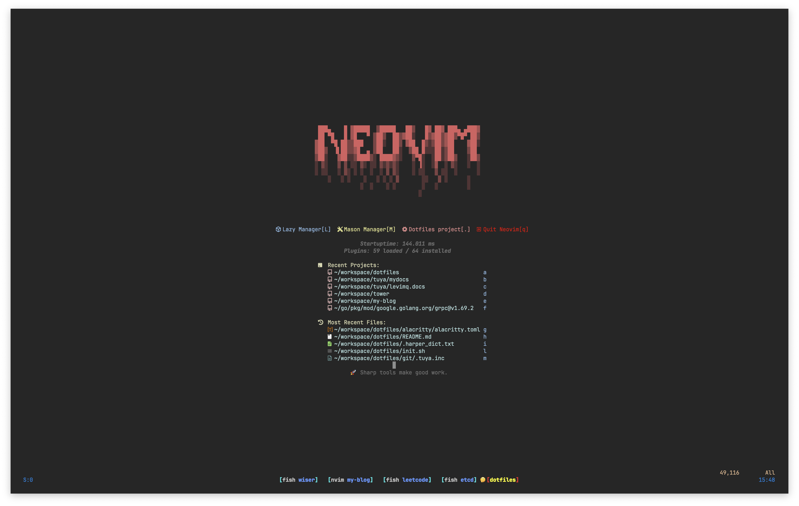

dotfiles
-----------------------------------------



My personal dotfiles

These dotfiles are very personal, include fish, neovim, git, tmux and so on. I know that everyone has a different taste; hence fork this repository or copy/paste these files into your own repository.

# Requirements

- git (for automatic installation)
- curl (for request init.sh)

# Setup
```bash
bash -c "$(curl -fsSL https://raw.githubusercontent.com/wiserfz/dotfiles/master/init.sh)"

# make fish shell default
fish_path = $(which fish)
echo $fish_path | sudo tee -a /etc/shells
chsh -s $fish_path
```
